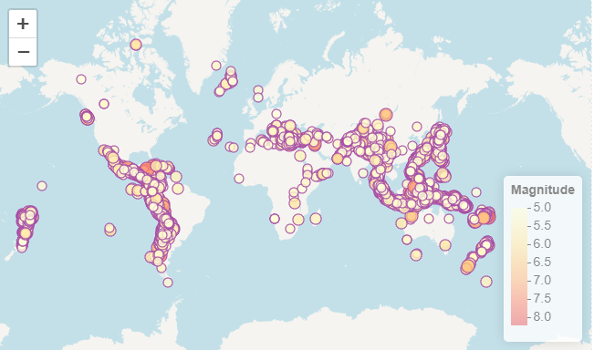
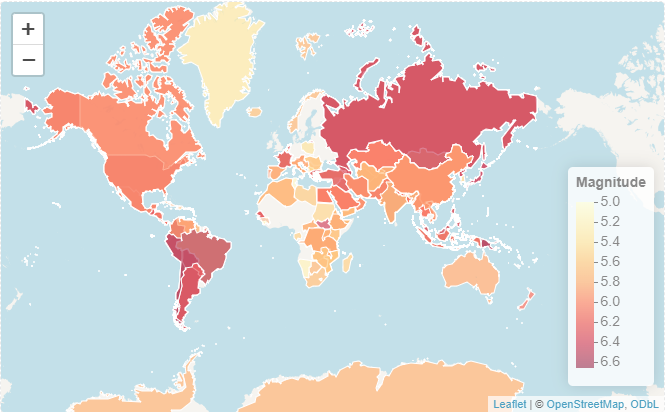

```{r, read_lib, include=FALSE}

# install.packages('spacyr')
#spacy_install()
# install.packages('stringr')
#install.packages('countries')
#install.packages("rnaturalearthdata")
#install.packages('skimr')
# install.packages("webshot2")
# install.packages("htmlwidgets")

#install.packages('float')
library(lubridate)
library(dplyr)
library(ggplot2)
library(ggpubr)
library(patchwork)
library(zoo)
library(plotly)
library(spacyr)
library(sf)
spacy_initialize(model = "en_core_web_sm")
library(stringr)
library(tidyr)
library(countries)
library(rnaturalearth)
library(rnaturalearthdata)
library(leaflet)
library(knitr)
library(skimr)
library(webshot2)
library(htmlwidgets)
library(terra)
library(knitr)
library(tibble)
library(GGally)
library(float)
```

# Data Wrangling Steps

1.  Convert date columns into for both earthquake and query dataframes: a date_tine column and date column

2.  Lower the case in all the column names in the earthquake dataframe and remove the period,".", character in the column names

3.  Lower the case of the of the values in the **id** and **type** column in the earthquake dataframe, for easy joining

4.  Find column names that are common in both the earthquake and query dataframes, and rename some column names originating from the query dataframe to avoid duplicated column names before joining \*word this better

5.  Join the two dataframes using the id,date, and type columns: df

6.  Filter for type='earthquake' in the df dataframe, which gives the final df_earthquake dataframe from which the analysis is performed on.

7.  Replace in NA values of the common columns with values from the corresponding column in the columns from the query dataframe \*word this better again.

8.  Create richter_scale column using the category definition from [@usgs_magnitude]

```{r,read_data,echo=FALSE,eval=TRUE}

query=read.csv("query.csv")
earth_quakes=read.csv("Earthquakes_1965_2016.csv")


```

```{r,data_det,echo=FALSE,eval=F}
# check query df details
dim(query)
dim(earth_quakes)
```

```{r,date_con,echo=FALSE,eval=TRUE}
# Change date columns to datetime
query$dt_date_time=ymd_hms(query$time)
query$date_final=date(query$dt_date_time)

```

```{r date_con_2, eval=TRUE, echo=FALSE}
#| message: true
#| warning: false
#| fig-height: 6
#| fig-width: 6
#| paged-print: true


# Split data into 2 then put back together


earth_quakes$dt_date_time=earth_quakes%>% mutate(dt_date_time= mdy_hms(paste(Date,Time))) %>% pull(dt_date_time)

earth_quake_na=earth_quakes %>% filter(is.na(dt_date_time))
earth_quake_non_na=earth_quakes %>% filter(!is.na(dt_date_time))
earth_quake_na$dt_date_time=earth_quake_na %>% mutate(dt_date_time=ymd_hms(Date)) %>% pull(dt_date_time) 

earth_quakes_final=rbind(earth_quake_na,earth_quake_non_na)
earth_quakes_final$date_final=date(earth_quakes_final$dt_date_time)


```

```{r,lower_col,echo=FALSE,eval=TRUE}
# lower the case of column names
colnames(query)=tolower(colnames(query))


# lower the case of the columns names in earth quake df and remove period character in column names
colnames(earth_quakes_final)=tolower(colnames(earth_quakes_final))
colnames(earth_quakes_final)=gsub("\\.","",colnames(earth_quakes_final))

# lower the case of the ID values
earth_quakes_final$id=tolower(earth_quakes_final$id)
earth_quakes_final$type=tolower(earth_quakes_final$type)
```

```{r,df_join,echo=FALSE,eval=TRUE}

# find common columns in both dataframes
# these will be used to join the two dataframes
eq_cols=names(earth_quakes_final)
query_cols=names(query)

join_cols=intersect(eq_cols,query_cols)
join_cols=join_cols[join_cols!='time']

ex_cols=c('date_final','id','type')

# rename common cols in the query dataframe to get rid of duplicated column names once the two dataframes are joined
for(col in join_cols){
  if(col %in% ex_cols){
  names(query)[names(query) == col] = col}
  else{
    names(query)[names(query) == col] = paste0(col,'_query')
  }
    
    
}

query=query[, !duplicated(colnames(query))]

df=full_join(earth_quakes_final,query, by=ex_cols )

# filter for earthqauke data

df_earthquake=dplyr::filter(df, `type` =='earthquake')

# Fill in na for some columns


df_earthquake=df_earthquake %>% mutate(magnitude=case_when(is.na(magnitude) & !is.na(mag)~ mag,
                                             TRUE ~magnitude
                                             )) %>% mutate(rootmeansquare=case_when(is.na(rootmeansquare) & !is.na(rms)~ rms,
                                             TRUE ~rootmeansquare
                                             )) %>% 
mutate(rootmeansquare=case_when(is.na(magnitudeerror) & !is.na(magerror)~ magerror,
                                             TRUE ~magnitudeerror
                                             )) %>% 
  
mutate(depth=case_when(is.na(depth) & !is.na(depth_query)~ depth_query,
                                             TRUE ~depth
                                             )) %>% 
 
mutate(deptherror=case_when(is.na(deptherror) & !is.na(deptherror_query)~ deptherror_query,
                                             TRUE ~deptherror
                                             ))  %>% 
mutate(dt_date_time=case_when(is.na(dt_date_time) & !is.na(dt_date_time_query)~ dt_date_time_query,
                                             TRUE ~dt_date_time
                                             ))  %>%  
  
mutate(horizontalerror=case_when(is.na(horizontalerror) & !is.na(horizontalerror_query)~ horizontalerror_query,
                                             TRUE ~horizontalerror
                                             )) %>% 
mutate(latitude=case_when(is.na(latitude) & !is.na(latitude_query)~ latitude_query,
                                             TRUE ~latitude
                                             )) %>% 
mutate(longitude=case_when(is.na(longitude) & !is.na(longitude_query)~ longitude_query,
                                             TRUE ~longitude
                                             )) %>% 
  
mutate(source=case_when(is.na(source) & !is.na(magsource)~ magsource,
                                             TRUE ~source
                                             )) %>% 
  
mutate(status=case_when(is.na(status) & !is.na(status_query)~ status_query,
                                             TRUE ~status
                                             )) 
   


```

```{r,mag_cat,echo=FALSE,eval=TRUE}
df_earthquake$richter_scale=df_earthquake %>% mutate(richter_scale=case_when(
                                                  #magnitudetype=='ML' &
                                                  magnitude>=1 & magnitude<=1.9~'Micro',
                                                  #magnitudetype=='ML' &
                                                  magnitude>=2 & magnitude<=2.9~'Minor',
                                                  #magnitudetype=='ML' &
                                                  magnitude>=3 & magnitude<=3.9~'Slight',
                                                  #magnitudetype=='ML' &
                                                  magnitude>=4 & magnitude<=4.9~'Light',
                                                  #magnitudetype=='ML' &
                                                  magnitude>=5 & magnitude<=5.99~'Moderate',
                                                  #magnitudetype=='ML' &
                                                  magnitude>=6 & magnitude<=6.9~'Strong',
                                                  #magnitudetype=='ML' &
                                                  magnitude>=7 & magnitude<=7.9~'Major',
                                                  #magnitudetype=='ML' &
                                                  magnitude>=8 & magnitude<=8.9~'Great',
                                                  #magnitudetype=='ML' &
                                                  magnitude>=9 & magnitude<=9.9~'Extreme'
                                                  #magnitudetype!='ML'~'Other',
                                                  
                                                  
                                                  
                                                    
)
                         ) %>% pull(richter_scale)


```

```{r, drop_cols,eval=TRUE,echo=FALSE}

all_cols=names(df_earthquake)
keep_cols=all_cols[!all_cols %in% c("time.x","dt_date_time_query","date","time.y")]

df_earthquake=df_earthquake %>% select(all_of(keep_cols))
```

# General Data Analysis

#### Earthquake Magnitude Distributions

```{r,df_attr,eval=TRUE,echo=FALSE}

# comeback and find a tidyier way of showing this
#names(skim(df_earthquake))
```

```{r,mg_summ,echo=F,eval=T}

#| message: false
#| warning: false
#| fig-height: 10
#| fig-width: 10
#| paged-print: false
#| label: fig-barplot1
#| fig-cap: "Counts of Earthquake Counts Per Scale Category"

# Magnitude summary Statistics

# Total number of inidividual eq
df_earthquake %>%  
  distinct(id,richter_scale) %>% 
  mutate(richter_scale=factor(richter_scale,levels=c('Micro','Minor','Slight','Light','Moderate','Strong','Major','Great','Extreme'))) %>% 
  group_by(richter_scale) %>% 
  summarize(scale_total=length(id)) %>% 
  mutate(percentage=scale_total/sum(scale_total),
         label=scales::percent(percentage)) %>% 
  ggplot(aes(x = richter_scale, y = scale_total)) +
  geom_col(fill = "steelblue") +
  geom_text(aes(label = label), vjust = -0.5) +
  labs(title = "Counts of Earthquakes Per Scale Category",
       x = "scale",y='count')+
  scale_y_continuous(limits = c(0, 30000))+
  theme_minimal()
  

```

In total, there have been \~34.1K recorded unique instances of earthquakes from 1965 to 2013. By category, Moderate category earthquakes dominate accounting for \~76% of recorded IDs.

```{r,counts,eval=TRUE,echo=F}

#| message: false
#| warning: false
#| fig-height: 8
#| fig-width: 10
#| paged-print: false


summ_tab=as_tibble_row(summary(df_earthquake$magnitude))

summ_tab$Total=df_earthquake %>% summarize(n_distinct(id)) %>% pull()
summ_tab=summ_tab %>% relocate(Total)
colnames(summ_tab)=c('Total','Min','Q1','Median','Mean','Q3','Max')


kable(summ_tab, caption = "earthquake magnitude summary")


```

Earthquake are mostly distributed above/ to the right of the median earthquake magnitudes; \~60% of ids equal or lie above the median earthquake magnitude \*(look at how this looks geograohically) .

```{r,num_dist_cnt,eval=F,echo=F}
# Distribution of p2

medi_an=median(df_earthquake$magnitude)   

df_earthquake %>% distinct(id,magnitude) %>% 
  mutate(gr_med=case_when(magnitude>=medi_an~1,
                          magnitude<medi_an~0)
         ) %>% summarize(total_gr=sum(gr_med),count_total=length(gr_med)) %>% 
  mutate(percentage=(total_gr/count_total)*100)
```

```{r,mag_dist,eval=TRUE,echo=F}
#| message: false
#| warning: false
#| paged-print: false
#| label: fig-barplot
#| fig-cap: "Distribution of Earthquake Magnitudes"

p2=df_earthquake %>%  
  select(magnitude,richter_scale) %>% 
  ggplot(aes(y=magnitude))+
  geom_boxplot()+
  coord_flip()+
  labs(title = "Distribution of Earthquake Magnitudes",
       y = "magnitude") +
  theme_minimal()

p2
```

### Feature Correlations

In absolute terms, azimuthal gap {enter definition here}shows the highest linear correlation with earthquake magnitude, whilst magnitude seismic stations show the highest overall feature absolute correlations with azimuthal gap and root-mean-square at 35% and 33%, respectively. Root Mean Square and magnitude error show perfect linear correlation- looks like they measure the same thing!

```{r az_rms_mg,eval=TRUE, echo=FALSE}
#| message: false
#| warning: false
#| fig-height: 6
#| fig-width: 8
#| label: fig-heatmap1
#| fig-cap: "Feature Correlation Matrix"


# Also explore relationship etween azimuthal gap,rms and earthqake magnitudes
library(reshape2)
corr_data=df_earthquake %>% select(azimuthalgap,rootmeansquare,magnitude,depth,deptherror,horizontaldistance,horizontalerror,magnitudeseismicstations,magnitudeerror,nst) %>% 
  select(where(is.numeric)) %>% 
  cor(use = "pairwise.complete.obs")


corr_data_df=melt(corr_data)

corr_data_df %>% ggplot(aes(x=Var2, y=Var1, fill=value))+
geom_tile() +
  scale_fill_gradient2(low = "blue", high = "red", mid = "white", 
                       midpoint = 0, limit = c(-1,1), space = "Lab", 
                       name="Pearson\nCorrelation") +
  geom_text(aes(label = round(value, 2)), color = "black")+
  labs(title = "Feature Correlation Matrix",x='Feature',y='Feature')+
  theme(axis.text.x = element_text(angle = 45, vjust = 0.5, hjust = 1))


  

```

```{r pairwise_plot,eval=T,echo=F}
#| message: false
#| warning: false
#| fig-height: 10
#| fig-width: 15
#| paged-print: false
#| label: fig-scatterplot1
#| fig-cap: "Feature Pairwise Plots"

df_earthquake %>% select(azimuthalgap,rootmeansquare,magnitude,depth,deptherror,horizontaldistance,horizontalerror,magnitudeseismicstations,magnitudeerror,nst) %>% 
  ggpairs(columns=1:10) +
  labs(title = "Feature Pairwise Plot")+
  theme_minimal()
  # aes(color=richter_scale,
                         #       alpha=0.5))
```

When looking at the shape of distributions as well as the statistical significance of the correlations, the magnitude shows the significant correlations with the following physical features (the actual physical attributes of the earthquake):

-   horizontal distance ( negatively correlated at 1% level of significance)

-   depth ( positively correlated at 1% level of significance)

Whilst the error associated with the measured magnitude, magnitude error, looks to be significantly correlated with the following:

-   azimuthal gap (positively correlated at 1%)

-   magnitude (positively correlated at 5%)

-   depth error (positively correlated at 1%)

-   magnitude seismic stations (negatively correlated at 1%)

```{r,depth_mag,echo=FALSE,eval=T}

#| message: false
#| warning: false
#| fig-height: 10
#| fig-width: 12
#| paged-print: false
#| label: fig-barplots2
#| fig-cap: "Average Earthquake Depth Per Scale Category"


p1=df_earthquake %>%  
  select(magnitude,depth,richter_scale) %>% 
    mutate(richter_scale=factor(richter_scale,levels=c('Micro','Minor','Slight','Light','Moderate','Strong','Major','Great','Extreme'))) %>%
  #group_by(richter_scale) %>% 
  #summarize(avg_depth=mean(depth,rm.na=T)) %>% 
  ggplot(aes(y=depth,color=richter_scale))+
  geom_boxplot() +
  labs(title = "Earthquake Depth Distribution Per Scale",
       y = 'depth') +
  theme_minimal()


p2=df_earthquake %>% filter(!is.na(depth)) %>% 

    mutate(richter_scale=factor(richter_scale,levels=c('Micro','Minor','Slight','Light','Moderate','Strong','Major','Great','Extreme'))) %>% 
  group_by(richter_scale) %>% 
  summarise(mean_depth=mean(depth)) %>% 
  
  ggplot(aes(x=richter_scale,y=mean_depth))+
  geom_col(fill = "steelblue") +
  labs(title = "Average Earthquake Depth Scale Category",
       y = "avg depth", x='scale') +
  theme_minimal()

p1/p2

```

Major earthquake types record the highest average depth across magnitude scales, although the distribution of depth across these scales do not show a statistical difference in these values\* bold claim here!

```{r dist_mag, eval=F, echo=FALSE}

#| message: false
#| warning: false
#| fig-height: 10
#| fig-width: 12
#| paged-print: false
#| label: fig-barplots3
#| fig-cap: "Average Earthquake Horizontal Distance Per Scale Category"


p1=df_earthquake %>%  
  select(magnitude,richter_scale,horizontaldistance) %>% 
    mutate(richter_scale=factor(richter_scale,levels=c('Micro','Minor','Slight','Light','Moderate','Strong','Major','Great','Extreme'))) %>%
  #group_by(richter_scale) %>% 
  #summarize(avg_depth=mean(depth,rm.na=T)) %>% 
  ggplot(aes(y=horizontaldistance,color=richter_scale))+
  geom_boxplot() +
  labs(title = "Earthquake Horizontal Distance Distribution Per Scale",
       y = 'horizontal distance') +
  theme_minimal()


p2=df_earthquake %>% select(horizontaldistance,richter_scale) %>% filter( !is.na(horizontaldistance) ) %>%  
    mutate(richter_scale=factor(richter_scale,levels=c('Micro','Minor','Slight','Light','Moderate','Strong','Major','Great','Extreme'))) %>% 
  group_by(richter_scale) %>% 
  summarise(mean_dist=mean(horizontaldistance,rm.na=T)) %>% 
  ggplot(aes(x=richter_scale,y=mean_dist))+
  geom_col(fill = "steelblue") +
  labs(title = "Average Horizontal Distance Per Scale Category",
       y = "avg h.distance", x='scale') +
  theme_minimal()

p1/p2


```

The average horizontal distance is highest for moderate earthquake types - although there are a LOT of null values for this feature so...\*\
There is also no significant difference in the distributions of this features across scale categories.\

# Temporal Data Analysis

#### General Earthquake Counts Pear Year

```{r eq_per_dt, eval=TRUE, echo=FALSE}
#| message: false
#| warning: false
#| fig-height: 6
#| fig-width: 8
#| paged-print: false
#| label: fig-barplots4
#| fig-cap: "Earthqake occurances over time"


p1=df_earthquake %>% select(id,date_final,magnitude) %>% 
  mutate(year_=year(date_final)) %>% 
  group_by(year_) %>% 
  summarize(nr_eq=n_distinct(id),avg_mg=mean(magnitude)) %>% 
  arrange(year_) %>% 
   mutate(running_avg = rollmean(nr_eq, k =3, fill = NA, align = "right")) %>% 
  ggplot(aes(x=year_,y=nr_eq))+
  geom_col(stat = 'identity')+
  labs(title = "Number of Earthquakes per year",y='count',
       x= "year") +
  theme_minimal()
  
 p2=df_earthquake %>% select(id,date_final,magnitude) %>% 
  mutate(year_=year(date_final)) %>% 
  group_by(year_) %>% 
  summarize(nr_eq=n_distinct(id),avg_mg=mean(magnitude)) %>% 
  ggplot(aes(x=year_,y=avg_mg))+
  geom_line()+
  labs(title = "Yearly Average Earthquake Magnitude ",y='avg magnitude',
       x = "year") +
  theme_minimal()
 
 
p3=df_earthquake %>% select(id,date_final,depth) %>% 
  mutate(year_=year(date_final)) %>% 
  group_by(year_) %>% 
  summarize(nr_eq=n_distinct(id),avg_mg=mean(depth)) %>% 
  ggplot(aes(x=year_,y=avg_mg))+
  geom_line()+
  labs(title = "Yearly Average Earthquake Depth ",y='avg depth',
       x = "year") +
  theme_minimal()
 
p5=df_earthquake %>% 
  select(id, date_final, magnitude) %>% 
  mutate(year_ = year(date_final)) %>% 
  group_by(year_) %>% 
  summarize(
    nr_eq = n_distinct(id),
    avg_mg = mean(magnitude)
  ) %>% 
  arrange(year_) %>% 
  mutate(
    pct_change = (nr_eq - lag(nr_eq)) / lag(nr_eq) * 100,
    moving_pct_change = rollmean(pct_change, k = 3, fill = NA, align = "right")
  ) %>%
  ggplot(aes(x = year_)) +

  geom_line(aes(y = pct_change, color = "Percentage Change")) +
  geom_point(aes(y = pct_change, color = "Percentage Change")) +

  geom_line(aes(y = moving_pct_change, color = "3-Year Running Average")) +
  #geom_point(aes(y = moving_pct_change, color = "Percentage Change(%)")) +

  scale_color_manual(
    name = "",
    values = c(
      "Percentage Change" = "blue",
      "3-Year Running Average" = "purple"
    )
  ) +

  labs(
    title = "Yearly Percentage Change in Earthquake Count",
    y = "Percentage Change(%)",
    x = "Year"
  ) +

  theme_minimal()

nst_p=df_earthquake %>% distinct(id,date_final,nst) %>% 
  filter(!is.na(nst)) %>% 
  mutate(year_=year(date_final)) %>% 
  group_by(year_) %>% 
  summarize(nst_cnt=sum(nst,rm.na=T)) %>% 
  ggplot(aes(x=year_,y=nst_cnt))+
  geom_line()+
  labs(title = "Yearly Count of number of seismic stations (nst)",y='nst count',
       x = "year") +
  theme_minimal()
 
(p1/p5/nst_p)
 
#ggplotly(p5)

```

The number of recorded earthquake occurrences has seen a steep increase since 2016, with the number peaking in 2021 (2.2K), showing a 135% increase from the previous year \*find a way to quantify this better over a trend rather than a point change- we also see coincides with the increase in the number of seismic stations around the same time

How does this relate to the number of stations?

```{r,mag_time, eval=TRUE, echo=FALSE}

#| message: false
#| warning: false
#| fig-height: 5
#| fig-width: 8
#| paged-print: false
#| label: fig-barplots5
#| fig-cap: "Earthqake Average magnitudes over time"


(p2/p3)
#ggplotly(p3)


```

Yearly average recorded magnitudes were mostly stable, averaging \~5.8 from 1973 to 2015, but saw a \~10% fall from 2015 to 2018 whilst earthqauke average depths have shown a declining trend from 2002

```{r,hr_day,eval=TRUE, echo=FALSE}

#| message: false
#| warning: false
#| fig-height: 5
#| fig-width: 8
#| paged-print: false
#| label: fig-barplots6
#| fig-cap: "Earthqake Average Hourly Averages"


library(ggridges)
# eq count and magnitude per time of day
p1=df_earthquake %>% select(dt_date_time,id,magnitude) %>% 
  mutate(hr_day=hour(dt_date_time)) %>% 
  group_by(hr_day) %>% 
  summarize(nr_eq=length(id),mean_mg=mean(magnitude)) %>% 
  ggplot(aes(x=hr_day,y=nr_eq))+
  geom_col(stat = 'identity')+
  labs(title = "Hourly Counts",y='count',
       x= "hour of day") +
  theme_minimal()

p2=df_earthquake %>% select(dt_date_time,id,magnitude) %>% 
  mutate(hr_day=hour(dt_date_time)) %>% 
  group_by(hr_day) %>% 
  summarize(nr_eq=length(id),mean_mg=mean(magnitude)) %>% 
  ggplot(aes(x=hr_day,y=mean_mg))+
  geom_line()+
  geom_point()+
  labs(title = "Hourly Mean Magnitudes",y='average magnitude',
       x= "hour of day") +
  theme_minimal()


p1/p2


```

```{r,temp_corr,eval=TRUE, echo=FALSE}

#| message: false
#| warning: false
#| fig-height: 5
#| fig-width: 6
#| paged-print: false
#| label: fig-barplots7
#| fig-cap: "Hourly Magnitude Hourly Distributions"


p3=df_earthquake %>% select(dt_date_time,id,magnitude,richter_scale) %>%
  mutate(hr_day=hour(dt_date_time)) %>%
  mutate(richter_scale=factor(richter_scale,levels=c('Micro','Minor','Slight','Light','Moderate','Strong','Major','Great','Extreme'))) %>% 
  #group_by(hr_day,richter_scale) %>%
  #summarize(nr_eq=length(id),mean_mg=mean(magnitude)) %>%
  ggplot(aes(x=hr_day,y=richter_scale,fill=richter_scale))+
  geom_density_ridges()+
  #geom_ridgeline(aes(height=nr_eq))+
  labs(title = "Distributions of Earthquake Occurances By Hour of Day",y='Scale',x= "hour of day") +
  theme_minimal()

p3


```

Overall, earthquake occurrences show relatively uniform distributions/counts though out the day, with Extreme scale showing slight peak at the earlier hours of the day.

# Spatial Analysis

```{r,loc_ext_spcy,eval=F, echo=FALSE}
# Extract eq locations from the place column using spacy
# Store results in a csv
# This code block takes a while so we use the results readiliy saved in a csv

location_entities=spacy_extract_entity(eq_places$place) %>% filter(ent_type=='GPE') %>% select(doc_id,text) # GPE is spacy code for location entity types

write.csv(location_entities, "location_entities.csv", row.names = FALSE)

```

```{r,loc_ext,eval=T, echo=FALSE}

# extract locations from "place" column

eq_places=df_earthquake %>% filter(!is.na(place)) %>% select(id,place)  %>% mutate(doc_id=paste0('text',row_number())) %>% select(id,place,doc_id)


# Load the extracted Entities

location_entities=read.csv("location_entities.csv")


tagged_locations=left_join(eq_places,location_entities, by='doc_id') %>% rename(location=text)


#join back to df_earthquake
df_earthquake_=left_join(df_earthquake,tagged_locations,by=c('id','place'))


```

```{r,sdf,eval=T, echo=FALSE}

# Attempt to extract more location/country data from in-built spatial data set
# perform a spatial join on between world_countries dataframe and sdf_earthquake
# Using a st_is_within_distnace predicate to attempt to tag ids that are with 100KM to the nearest country
sdf_earthquake=st_as_sf(df_earthquake_,coords=c('longitude','latitude'),crs=4326)

world_countries <- ne_countries(scale = "medium", returnclass = "sf")

wc=world_countries %>% select(name,geometry) %>% rename(country_=name)
  #reproject to meters


sdf_earthquake=st_join(st_transform(sdf_earthquake, 3857),st_transform(wc, 3857),join=st_is_within_distance,dist=50000*2,left=T)%>% 
  mutate(country_fill=coalesce(country_,location)) %>% 
  mutate(location_fill=coalesce(location,country_)) %>% 
  mutate(country_final= coalesce(country_fill,location_fill)) %>% 
  mutate(country_final=coalesce(country_final,'Unknown')) 
  
  
sdf_earthquake=st_transform(sdf_earthquake, crs=4326)

```

```{r,eq_map,eval=F,echo=FALSE}

#| message: false
#| warning: false
#| fig-height: 8
#| fig-width: 12
#| fig-cap: "Global Distribution of Earthquake Occurances"

# Since indonesia contains /has the highest occurances of Eq, I'll focus on corrvariables in that reghion (comeback!)


all_countries <- list_countries() 

world=ne_countries(scale='medium',returnclass='sf')

sdf_earthquake_countries=st_join(sdf_earthquake,world['name'])


all_countries <- list_countries() 


col_pal <- colorNumeric(
  palette = "YlOrRd",
  domain = sdf_earthquake$magnitude
)

id_df=sdf_earthquake %>% 
  mutate(country=case_when(
  location %in% all_countries ~location)) %>% 
  filter( !is.na(country)) %>% 
  distinct(id,country,magnitude,location,richter_scale,geometry)


mp=leaflet(id_df) %>%
  addTiles() %>%
  addCircleMarkers(
    radius = ~magnitude,   
    color = "purple",       
    weight = 1,             
    opacity = 1,               
    fillColor = ~col_pal(magnitude), 
    fillOpacity = 0.8,         
    stroke = TRUE,
    label = ~country
  ) %>%
  addLegend(
    pal = col_pal, 
    values = ~magnitude, 
    position = "bottomright", 
    title = "Magnitude"
  )

mp

#saveWidget(mp, "eq_map.html", selfcontained = TRUE)


#webshot("eq_map.html", file = "eq_map.png", vwidth = 1000, vheight = 800,delay = 2)

#knitr::include_graphics("eq_map.png")
```



```{r,top_countries_plot,eval=T, echo=FALSE}


#| message: false
#| warning: false
#| fig-height: 5
#| fig-width: 6
#| paged-print: false
#| label: fig-barplots8
#| fig-cap: "Earthquake Counts Per Country, Colored By Average Magnitude"

all_countries <- list_countries() 

p2=sdf_earthquake %>% mutate(country=case_when(
  location %in% all_countries ~location)) %>% filter( !is.na(country)) %>%
  distinct(id,country,magnitude) %>%
   group_by(country) %>%
  summarize(eq_count=n_distinct(id),avg_magnitude=mean(magnitude)) %>%
  arrange(desc(eq_count)) %>%
  head(20) %>%
  ggplot(aes(x=reorder(country,-eq_count),y=eq_count,fill=avg_magnitude))+
  geom_col(stat = 'identity')+
  labs(title = "Top 20 Countries By Earthquke Count ",y='Count',
       x= "Country") +
  scale_fill_gradient(low = "yellow", high = "red")+
  theme_minimal()+
  theme(axis.text.x = element_text(angle = 45, vjust = 0.5, hjust = 1))

# 

p2


```

Indonesia has the highest number of recorded earthquakes, whilst the gighrst average magnitudes are observed for Figi and Ecuador. When split by scale, Indonesia still shows the highest number of occurrences across both Strong and Moderate earthqake scales.

```{r,top_countries_plot_scale,eval=T, echo=FALSE}


#| message: false
#| warning: false
#| fig-height: 8
#| fig-width: 6
#| paged-print: false
#| label: fig-barplots8
#| fig-cap: "Earthquake Counts Per Country, Colored By Average Magnitude"

# plot earthquake freq by location
# Since there are some eq ids that have two locations tagged to them, use the first location tagged to them?
# Qs: Top countries by earthqake count-fill by avg magnitude
# Countries and ricter_scale- which countries experiace which eq type most commonly

p3=sdf_earthquake %>% mutate(country=case_when(
  location %in% all_countries ~location)) %>% filter( !is.na(country)) %>%
  distinct(id,country,magnitude,richter_scale) %>%
  mutate(richter_scale=factor(richter_scale,levels=c('Micro','Minor','Slight','Light','Moderate','Strong','Major','Great','Extreme'))) %>%
   group_by(country,richter_scale) %>%
  summarize(eq_count=n_distinct(id)) %>%
  group_by(country,richter_scale) %>%
  arrange(desc(eq_count)) %>%
  group_by(richter_scale) %>%
  slice_head(n = 5) %>%
  ggplot(aes(x=reorder(country,-eq_count),y=eq_count,fill = richter_scale))+
  geom_col(stat = 'identity')+
  labs(title = "Top 5 Countries Per Earthquake Ocurrances Facetted by Scale ",y='Count',
       x= "Country") +
  facet_wrap(~richter_scale,scales = "free")+
  theme_minimal()+
  theme(axis.text.x = element_text(angle = 45, vjust = 0.5, hjust = 1))

p3

```

Method- Performing a unary/dissolve join across all the point geometries that are in close proximity to the extracted country labels transforming the geomotries into country choropleths color-coded by the average magnitude of earthquakes across those polygons.

```{r,country_polygons,eval=F,echo=F}
#sdf_earthquake_countries
#plot(world['name'])
# This chunck takes a while to run

sdf_joined = st_join(
  st_transform(wc, 3857),                
  st_transform(sdf_earthquake, 3857),     
  join = st_is_within_distance,
  dist = 50000 * 2,
  left = TRUE
)

sdf_country = sdf_joined %>%
  group_by(country_final,magnitude) %>%   # adjust column name
  summarise(
    nr_eq = n_distinct(id),               # or n_distinct(id)
    .groups = "drop"
  )

#plot(sdf_country['nr_eq'])

country_geometries=sdf_country%>% select(country_final,magnitude) %>% filter(country_final!='Unknown') # remove unknown geometries

st_write(country_geometries, "country_geometries.gpkg")


```

```{r,country_appr,eval=F,echo=F}
# Read in file
country_geometries=st_read('country_geometries.gpkg')
plot_df=country_geometries %>% group_by(country_final) %>% 
  summarise(mean_magnitude=mean(magnitude))
#plot(plot_df['mean_magnitude'])

plot_df=st_transform(plot_df, 4326)

pal = colorNumeric(palette = "YlOrRd", domain = plot_df$mean_magnitude)

# 3. Build the map
cp=leaflet(plot_df) %>%
  addTiles() %>%
  addPolygons(
    fillColor = ~pal(mean_magnitude),
    weight = 1,
    opacity = 1,
    color = "white",
    fillOpacity = 0.7,
    label = ~paste0(country_final, ": ",mean_magnitude) # Tooltip on hover
  ) %>%
  addLegend(pal = pal, values = ~mean_magnitude, opacity = 0.7, title = "Magnitude", position = "bottomright")

```

{#country_chloropleths}

```{r,stat_map,eval=T,echo=FALSE}

# mag_groups<- sdf_earthquake %>% 
#   mutate(country=case_when(
#   location %in% all_countries ~location)) %>% 
#   group_by(country) %>%
#   summarize(mean_mag = mean(magnitude),
#             geometry = st_union(geometry))


vect_grid=vect(sdf_earthquake["magnitude"])

r = rast(
  ext(vect_grid),
  resolution = 0.9
)

raster_result = rasterize(
  vect_grid,
  r,
  field = "magnitude",   # your value column
  fun = mean             # what to do if multiple points fall in one cell
)

plot(raster_result)

# look into contour plots for eq magnitude, deoth and horzontal distance and other vars!!!!!
```
