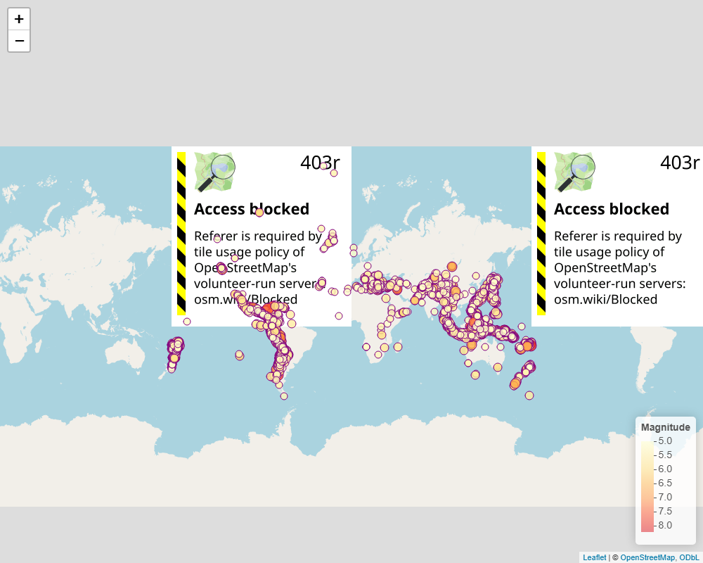
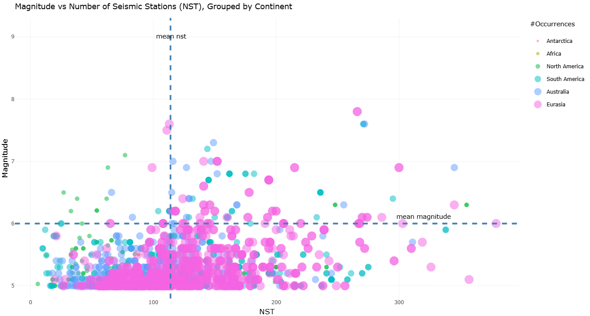

```{r, read_lib, include=FALSE}

# install.packages('spacyr')
#spacy_install()
# install.packages('stringr')
#install.packages('countries')
#install.packages("rnaturalearthdata")
#install.packages('skimr')
# install.packages("webshot2")
# install.packages("htmlwidgets")

#install.packages('float')
# install.packages("rworldmap")
library(lubridate)
library(dplyr)
library(ggplot2)
library(ggpubr)
library(patchwork)
library(zoo)
library(plotly)
library(spacyr)
library(sf)
spacy_initialize(model = "en_core_web_sm")
library(stringr)
library(tidyr)
library(countries)
library(rnaturalearth)
library(rnaturalearthdata)
library(leaflet)
library(knitr)
library(skimr)
library(webshot2)
library(htmlwidgets)
library(terra)
library(knitr)
library(tibble)
library(GGally)
library(float)
library(htmltools)
library(rworldmap)
library(kableExtra)
```

# Introduction

This report analyses earthquake data from 1965 to 2023. The data is sourced from the official USGS website and tracks global earthquake occurrences along with their key attributes, including magnitudes (measured using various magnitude types), horizontal distances, depths, approximate locations, and key measurement statistics.\
Although the time span of the data is quite extensive, the data set is significantly sparse across many attributes and observations, with regional and country locations missing for many observations. To enhance the data set, two key features have been added.The first is the "Scale" feature, which categorizes earthquake types into magnitude buckets using definitions from the Richter Scale.[^1] . The second involves location extraction techniques that provide approximate country and regional labels for different IDs. This is accomplished through spatial joins using built-in data from the rnaturalearth package, as well as utilizing Named Entity Recognition from the Spacy package to extract labelled country data directly from the data set. Exploratory insights are divided into three parts:

[^1]: Encyclopaedia Britannica, *Richter Scale*. Available at: <https://www.britannica.com/science/Richter-scale> (Accessed: 10 May 2026).

1.  General Data Analysis: This examines key feature relationships and correlations, primarily factored by the Scale feature.
2.  Temporal Analysis: This focuses on trends in earthquake occurrences over time.
3.  Spatial Analysis: This analyses important earthquake features from both country and regional perspectives.

# Data Wrangling Steps

1.  Convert date columns into datetime columns for both the earthquake and query data frames.

2.  Lower the case in all the column names in the earthquake data frame and remove all non-alphanumeric characters from the column names.

3.  Lower the case of the values in the **id** and **type** column in the earthquake data frame for easy joining.

4.  Find column names that are common in both the earthquake and query data frames, and rename some of these to avoid duplicated column names before joining.

5.  Join the two data frames using the **id, date, and type** columns and filter for **type='earthquake'** which gives the final df_earthquake data frame from which the analysis is performed.

6.  Replace the NA values in the common columns with values from the corresponding columns the query or earthquake data frames.

7.  Create richter_scale column derived from the bucketed magnitude values.[^2]

[^2]: The USGS states that magnitude types yield similar values for earthquakes between 6.5 and 7.0. In the combined earthquake dataframe, 817 earthquakes exceed a magnitude of 7, making up about 2% of the data. Thus, magnitude scale categories are based solely on nominal values.

```{r,read_data,echo=FALSE,eval=TRUE}

query=read.csv("query.csv")
earth_quakes=read.csv("Earthquakes_1965_2016.csv")


```

```{r,data_det,echo=FALSE,eval=F}
# check query df details
dim(query)
dim(earth_quakes)
```

```{r,date_con,echo=FALSE,eval=TRUE}
# Change date columns to datetime
query$dt_date_time=ymd_hms(query$time)
query$date_final=date(query$dt_date_time)

```

```{r date_con_2, eval=TRUE, echo=FALSE}
#| message: true
#| warning: false
#| fig-height: 6
#| fig-width: 6
#| paged-print: true


# Split data into 2 then put back together


earth_quakes$dt_date_time=earth_quakes%>% mutate(dt_date_time= mdy_hms(paste(Date,Time))) %>% pull(dt_date_time)

earth_quake_na=earth_quakes %>% filter(is.na(dt_date_time))
earth_quake_non_na=earth_quakes %>% filter(!is.na(dt_date_time))
earth_quake_na$dt_date_time=earth_quake_na %>% mutate(dt_date_time=ymd_hms(Date)) %>% pull(dt_date_time) 

earth_quakes_final=rbind(earth_quake_na,earth_quake_non_na)
earth_quakes_final$date_final=date(earth_quakes_final$dt_date_time)


```

```{r,lower_col,echo=FALSE,eval=TRUE}
# lower the case of column names
colnames(query)=tolower(colnames(query))


# lower the case of the columns names in earth quake df and remove period character in column names
colnames(earth_quakes_final)=tolower(colnames(earth_quakes_final))
colnames(earth_quakes_final)=gsub("\\.","",colnames(earth_quakes_final))

# lower the case of the ID values
earth_quakes_final$id=tolower(earth_quakes_final$id)
earth_quakes_final$type=tolower(earth_quakes_final$type)
```

```{r,df_join,echo=FALSE,eval=TRUE}

# find common columns in both dataframes
# these will be used to join the two dataframes
eq_cols=names(earth_quakes_final)
query_cols=names(query)

join_cols=intersect(eq_cols,query_cols)
join_cols=join_cols[join_cols!='time']

ex_cols=c('date_final','id','type')

# rename common cols in the query dataframe to get rid of duplicated column names once the two dataframes are joined
for(col in join_cols){
  if(col %in% ex_cols){
  names(query)[names(query) == col] = col}
  else{
    names(query)[names(query) == col] = paste0(col,'_query')
  }
    
    
}

query=query[, !duplicated(colnames(query))]

df=full_join(earth_quakes_final,query, by=ex_cols )

# filter for earthqauke data

df_earthquake=dplyr::filter(df, `type` =='earthquake')

# Fill in na for some columns


df_earthquake=df_earthquake %>% mutate(magnitude=case_when(is.na(magnitude) & !is.na(mag)~ mag,
                                             TRUE ~magnitude
                                             )) %>% mutate(rootmeansquare=case_when(is.na(rootmeansquare) & !is.na(rms)~ rms,
                                             TRUE ~rootmeansquare
                                             )) %>% 
mutate(magnitudeerror=case_when(is.na(magnitudeerror) & !is.na(magerror)~ magerror,
                                             TRUE ~magnitudeerror
                                             )) %>% 
  
mutate(depth=case_when(is.na(depth) & !is.na(depth_query)~ depth_query,
                                             TRUE ~depth
                                             )) %>% 
 
mutate(deptherror=case_when(is.na(deptherror) & !is.na(deptherror_query)~ deptherror_query,
                                             TRUE ~deptherror
                                             ))  %>% 
mutate(dt_date_time=case_when(is.na(dt_date_time) & !is.na(dt_date_time_query)~ dt_date_time_query,
                                             TRUE ~dt_date_time
                                             ))  %>%  
  
mutate(horizontalerror=case_when(is.na(horizontalerror) & !is.na(horizontalerror_query)~ horizontalerror_query,
                                             TRUE ~horizontalerror
                                             )) %>% 
mutate(latitude=case_when(is.na(latitude) & !is.na(latitude_query)~ latitude_query,
                                             TRUE ~latitude
                                             )) %>% 
mutate(longitude=case_when(is.na(longitude) & !is.na(longitude_query)~ longitude_query,
                                             TRUE ~longitude
                                             )) %>% 
  
mutate(source=case_when(is.na(source) & !is.na(magsource)~ magsource,
                                             TRUE ~source
                                             )) %>% 
  
mutate(status=case_when(is.na(status) & !is.na(status_query)~ status_query,
                                             TRUE ~status
                                             )) 
   


```

```{r,mag_cat,echo=FALSE,eval=TRUE}
df_earthquake$richter_scale=df_earthquake %>% mutate(richter_scale=case_when(
                                                  #magnitudetype=='ML' &
                                                  magnitude>=1 & magnitude<=1.9~'Micro',
                                                  #magnitudetype=='ML' &
                                                  magnitude>=2 & magnitude<=2.9~'Minor',
                                                  #magnitudetype=='ML' &
                                                  magnitude>=3 & magnitude<=3.9~'Slight',
                                                  #magnitudetype=='ML' &
                                                  magnitude>=4 & magnitude<=4.9~'Light',
                                                  #magnitudetype=='ML' &
                                                  magnitude>=5 & magnitude<=5.99~'Moderate',
                                                  #magnitudetype=='ML' &
                                                  magnitude>=6 & magnitude<=6.9~'Strong',
                                                  #magnitudetype=='ML' &
                                                  magnitude>=7 & magnitude<=7.9~'Major',
                                                  #magnitudetype=='ML' &
                                                  magnitude>=8 & magnitude<=8.9~'Great',
                                                  #magnitudetype=='ML' &
                                                  magnitude>=9 & magnitude<=9.9~'Extreme'
                                                  #magnitudetype!='ML'~'Other',
                                                  
                                                  
                                                  
                                                    
)
                         ) %>% pull(richter_scale)


```

```{r, drop_cols,eval=TRUE,echo=FALSE}
# remove redundant columns

all_cols=names(df_earthquake)
keep_cols=all_cols[!all_cols %in% c("time.x","dt_date_time_query","date","time.y")]

df_earthquake=df_earthquake %>% select(all_of(keep_cols))

df_att=data.frame(no.rows=nrow(df_earthquake),
                  no.columns=ncol(df_earthquake),
                  null_value_cnt=sum(is.na(df_earthquake)),
                  no.unique.ids =n_distinct(df_earthquake$id),
                  date_span= paste(min(df_earthquake$date_final),'-',max(df_earthquake$date_final))
                  )

kable(df_att, caption = "df_earthquake dataset summary")


```

```{r,var_summ,echo=F,eval=T}

col_types = sapply(df_earthquake, class)

col_types_df = data.frame(column = names(col_types), datatype = as.character(col_types))

col=c('column','na_count')
na_cnt=data.frame(colSums(is.na(df_earthquake))) %>%
  rownames_to_column("old_index") %>% 
  rename_with(~ col)


col_types=left_join(col_types_df,na_cnt,by='column') %>% rename(feature='column')

feat_mins=sapply(df_earthquake, function(x) {
  if (is.numeric(x)) {
    min(x, na.rm = TRUE)
  } else {
    NA
  }
})

feat_q1=sapply(df_earthquake, function(x) {
  if (is.numeric(x)) {
    quantile(x, probs = 0.25, na.rm = TRUE)
  } else {
    NA
  }
})

feat_mean=sapply(df_earthquake, function(x) {
  if (is.numeric(x)) {
    mean(x,na.rm = TRUE)
  } else {
    NA
  }
})

feat_median=sapply(df_earthquake, function(x) {
  if (is.numeric(x)) {
    quantile(x, probs = 0.5, na.rm = TRUE)
  } else {
    NA
  }
})

feat_q75=sapply(df_earthquake, function(x) {
  if (is.numeric(x)) {
    quantile(x, probs = 0.75, na.rm = TRUE)
  } else {
    NA
  }
})

feat_max=sapply(df_earthquake, function(x) {
  if (is.numeric(x)) {
    max(x,na.rm = TRUE)
  } else {
    NA
  }
})

feat_var=sapply(df_earthquake, function(x) {
  if (is.numeric(x)) {
    var(x, na.rm = TRUE)
  } else {
    NA
  }
})


variable_summ=data.frame(feature=names(df_earthquake), 
                         `min`=unname(feat_mins),
                         q25=unname(feat_q1),
                         `mean`=unname(feat_mean),
                         `meadian`=unname(feat_median),
                         q75=unname(feat_q75),
                          `max`=unname(feat_max),
                         `sd`=round(unname(feat_var),2)**0.5
                         )

variable_summ=left_join(variable_summ,col_types,by='feature')
variable_summ=variable_summ %>% filter(!feature %in% c('latitude','longitude','latitude_query','longitude_query','depth_query','mag','deptherror_query','horizontal_error_query','magnst','magerror'))


```

# General Data Analysis

**Earthquake Counts and Magnitude Distributions**

```{r,df_attr,eval=T,echo=FALSE}

kable(na.omit(variable_summ), caption = 'Cleaned Earthquake Dataset Numeric Features Data Summary', format = "latex", booktabs = TRUE) %>%
  kable_styling(latex_options = c("hold_position","scale_down"))


```

```{r,mag_dist,eval=TRUE,echo=F}
#| message: false
#| warning: false
#| paged-print: false
#| label: fig-barplot
#| fig-cap: "Distribution of Earthquake Magnitudes"

p2=df_earthquake %>%  
  select(magnitude,richter_scale) %>% 
  ggplot(aes(y=magnitude))+
  geom_boxplot()+
  coord_flip()+
  labs(title = "Distribution of Earthquake Magnitudes",
       y = "magnitude") +
  theme_minimal()

phist=df_earthquake %>%  
  select(magnitude,richter_scale) %>% 
  ggplot(aes(x=magnitude))+
  geom_histogram()+
  labs(title = "Distribution of Earthquake Magnitudes",
       y = "magnitude") +
  theme_minimal()


```

```{r,dist_counts,eval=FALSE,echo=F}
gr_med_mag=df_earthquake %>% filter(magnitude>=median(df_earthquake$magnitude)) %>% summarize(n_distinct(id)) %>% pull()

gr_7_cnt=df_earthquake %>% filter(magnitude>=7) %>% 
  summarize(n_distinct(id)) %>% pull()


gr_med_mag/(df_earthquake  %>% 
  summarize(n_distinct(id)) %>% pull())


gr_75_mag=df_earthquake %>% filter(magnitude>=quantile(df_earthquake$magnitude,0.75)) %>% summarize(n_distinct(id)) %>% pull()

gr_75_mag/(df_earthquake  %>% 
  summarize(n_distinct(id)) %>% pull())

gr_7_cnt/(df_earthquake  %>% 
  summarize(n_distinct(id)) %>% pull())
```

```{r,mg_summ,echo=F,eval=T}
#| message: false
#| warning: false
#| fig-height: 6
#| fig-width: 10
#| paged-print: false
#| fig-cap: "Counts of Earthquake Counts Per Scale Category"

# Magnitude summary Statistics

# Total number of inidividual eq
p3_cont=df_earthquake %>%  
  distinct(id,richter_scale) %>% 
  mutate(richter_scale=factor(richter_scale,levels=c('Micro','Minor','Slight','Light','Moderate','Strong','Major','Great','Extreme'))) %>% 
  group_by(richter_scale) %>% 
  summarize(scale_total=length(id)) %>% 
  mutate(percentage=scale_total/sum(scale_total),
         label=scales::percent(percentage)) %>% 
  ggplot(aes(x = richter_scale, y = scale_total)) +
  geom_col(fill = "steelblue") +
  geom_text(aes(label = label), vjust = -0.5) +
  labs(title = "Counts of Earthquakes Per Scale Category",
       x = "scale",y='count')+
  scale_y_continuous(limits = c(0, 31000))+
  theme_minimal()
  
p2/p3_cont
```

In total, there have been \~34.1K recorded unique instances of earthquakes from 1965 to 2023, with the majority of these being Moderate earthquakes (magnitudes between 5.0 and 5.99), accounting for \~76% of recorded occurrences.\
Earthquake magnitudes are mostly distributed above/to the right of the median (5.6), with \~60% of occurrences lying above the median. \~30% of ids had magnitudes that exceeded the 75th percentile of 5.9. Only 2% of recorded earthquakes had a magnitude greater than 7.

```{r,counts,eval=F,echo=F}

#| message: false
#| warning: false
#| fig-height: 8
#| fig-width: 10
#| paged-print: false


summ_tab=as_tibble_row(summary(df_earthquake$magnitude))

summ_tab$Total=df_earthquake %>% summarize(n_distinct(id)) %>% pull()
summ_tab=summ_tab %>% relocate(Total)
colnames(summ_tab)=c('Total','Min','Q1','Median','Mean','Q3','Max')


kable(summ_tab, caption = "earthquake magnitude summary")


```

```{r,num_dist_cnt,eval=F,echo=F}
# Distribution of p2

medi_an=median(df_earthquake$magnitude)   

sk=df_earthquake %>% distinct(id,magnitude) %>% 
  mutate(gr_med=case_when(magnitude>=medi_an~1,
                          magnitude<medi_an~0)
         ) %>% summarize(total_gr=sum(gr_med),count_total=length(gr_med)) %>% 
  mutate(percentage=(total_gr/count_total)*100) %>% 
  rename(`greater than median`=total_gr,`total nr ids`=count_total)
```

**Feature Correlations**

In absolute terms, the number of seismic stations, **nst**, shows the highest linear correlation with earthquake magnitude at 30%, followed by azimuthal gap at 24%[^3].

[^3]: Azimuthal gap is defined as the largest angle between two adjacent seismic stations measured from an earthquake's epicenter (@azimuthal_gap_researchgate).

**Root mean square[^4]**,rms, and **magnitude error[^5]** show opposite sign individual correlations with respect to the recorded magnitude at 29% and -22%, respectively.

[^4]: Provides a measure of the fit of the observed arrival times to the predicted arrival times. See: U.S. Geological Survey metadata.

[^5]: Provides uncertainty in magnitude estimation. See: U.S. Geological Survey metadata.

Aside from related measurement variables (such as horizontal distance and its error), the **azimuthal gap** and **magnitude error** show the strongest correlation (\~ 0.35) among the all other features.

```{r az_rms_mg,eval=TRUE, echo=FALSE}
#| message: false
#| warning: false
#| fig-height: 6
#| fig-width: 8
#| label: fig-heatmap1
#| fig-cap: "Feature Correlation Matrix on subset of features"

# Also explore relationship etween azimuthal gap,rms and earthqake magnitudes
library(reshape2)
corr_data=df_earthquake %>% select(azimuthalgap,rootmeansquare,magnitude,depth,deptherror,horizontaldistance,horizontalerror,magnitudeseismicstations,magnitudeerror,nst) %>% 
  select(where(is.numeric)) %>% 
  cor(use = "pairwise.complete.obs")


corr_data_df=melt(corr_data)

corr_data_df %>% ggplot(aes(x=Var2, y=Var1, fill=value))+
geom_tile() +
  scale_fill_gradient2(low = "blue", high = "red", mid = "white", 
                       midpoint = 0, limit = c(-1,1), space = "Lab", 
                       name="Pearson\nCorrelation") +
  geom_text(aes(label = round(value, 2)), color = "black")+
  labs(title = "Feature Correlation Matrix",x='',y='Feature')+
  theme(
    axis.text.x = element_text(size = 14, angle = 45, vjust = 0.9, hjust = 1),
    axis.text.y = element_text(size = 14)
  )


  

```

```{r pairwise_plot,eval=T,echo=F}
#| message: false
#| warning: false
#| fig-height: 12.5
#| fig-width: 15
#| paged-print: false
#| label: fig-scatterplot1
#| fig-cap: "Feature Pairwise Plots"

df_earthquake %>% select(azimuthalgap,rootmeansquare,magnitude,depth,deptherror,horizontaldistance,horizontalerror,magnitudeseismicstations,magnitudeerror,nst,richter_scale) %>% 
  ggpairs(columns=(1:10), aes(color=richter_scale)) +
  labs(title = "Feature Pairwise Plot")+
  theme_minimal()
  # ,
                         #       alpha=0.5))
```

When analyzing the shape of distributions and the statistical significance of correlations, the following significant correlations with physical features of earthquakes are observed:

-   Horizontal distance: negatively correlated at the 1% level of significance

-   Depth: positively correlated at the 1% level of significance

Additionally, the error associated with the measured magnitude, referred to as magnitude error, shows significant correlations with the following factors:

-   Azimuthal gap: positively correlated at the 1% level of significance

-   Magnitude: positively correlated at the 5% level of significance

-   Depth error: positively correlated at the 1% level of significance

-   Number of magnitude seismic stations: negatively correlated at the 1% level of significance

##### **Earthquake Depth and Horizontal Distance Per Scale Category**

```{r,depth_mag,echo=FALSE,eval=T}

#| message: false
#| warning: false
#| fig-height: 8
#| fig-width: 12
#| paged-print: false
#| fig-cap: "Average Earthquake Depth Per Scale Category"


p1=df_earthquake %>%  
  select(magnitude,depth,richter_scale) %>% 
    mutate(richter_scale=factor(richter_scale,levels=c('Micro','Minor','Slight','Light','Moderate','Strong','Major','Great','Extreme'))) %>%
  #group_by(richter_scale) %>% 
  #summarize(avg_depth=mean(depth,rm.na=T)) %>% 
  ggplot(aes(y=depth,color=richter_scale))+
  geom_boxplot() +
  labs(title = "Earthquake Depth Distribution Per Scale",
       y = 'depth') +
  theme_minimal()


p2=df_earthquake %>% filter(!is.na(depth)) %>% 

    mutate(richter_scale=factor(richter_scale,levels=c('Micro','Minor','Slight','Light','Moderate','Strong','Major','Great','Extreme'))) %>% 
  group_by(richter_scale) %>% 
  summarise(mean_depth=mean(depth)) %>% 
  
  ggplot(aes(x=richter_scale,y=mean_depth))+
  geom_col(fill = "steelblue") +
  labs(title = "Average Earthquake Depth Scale Category",
       y = "avg depth", x='scale') +
  theme_minimal()

p1/p2

```

Major earthquake types record the highest average depth across magnitude scales, although the distribution of depth across these scales do not show an immediate significant difference.

```{r dist_mag, eval=T, echo=FALSE}

#| message: false
#| warning: false
#| fig-height: 4
#| fig-width: 5
#| paged-print: false
#| fig-cap: "Average Earthquake Horizontal Distance Per Scale Category"


p1=df_earthquake %>%  
  select(magnitude,richter_scale,horizontaldistance) %>% 
    mutate(richter_scale=factor(richter_scale,levels=c('Micro','Minor','Slight','Light','Moderate','Strong','Major','Great','Extreme'))) %>%
  #group_by(richter_scale) %>% 
  #summarize(avg_depth=mean(depth,rm.na=T)) %>% 
  ggplot(aes(y=horizontaldistance,color=richter_scale))+
  geom_boxplot() +
  labs(title = "Earthquake Horizontal Distance Distribution Per Scale",
       y = 'horizontal distance') +
  theme_minimal()


p2=df_earthquake %>% select(horizontaldistance,richter_scale) %>% filter( !is.na(horizontaldistance) ) %>%  
    mutate(richter_scale=factor(richter_scale,levels=c('Micro','Minor','Slight','Light','Moderate','Strong','Major','Great','Extreme'))) %>% 
  group_by(richter_scale) %>% 
  summarise(mean_dist=mean(horizontaldistance,rm.na=T)) %>% 
  ggplot(aes(x=richter_scale,y=mean_dist))+
  geom_col(fill = "steelblue") +
  labs(title = "Average Horizontal Distance Per Scale Category",
       y = "avg h.distance", x='scale') +
  theme_minimal()
p2
```

\~ 95% (\~32.5K) of IDs have missing values for horizontal depth, of the remaining 5% (\~1.5K), the average horizontal distance is highest for moderate earthquake types at 4.33m followed by strong earthquakes at 3.38m\

```{r,na_cnt,eval=F,echo=F}

(df_earthquake %>% select(horizontaldistance,richter_scale,id) %>% filter( !is.na(horizontaldistance) ) %>% 
  summarize(cnt=n_distinct(id)) %>% pull(cnt))/(df_earthquake %>% select(horizontaldistance,richter_scale,id) %>%  
  summarize(cnt=n_distinct(id)) %>% pull(cnt))
```

# Temporal Data Analysis

#### General Earthquake Occurrences Pear Year

```{r eq_per_dt, eval=TRUE, echo=FALSE}
#| message: false
#| warning: false
#| fig-height: 5
#| fig-width: 13
#| paged-print: false
#| label: fig-barplots4
#| fig-cap: "Earthqake occurances over time"


p1=df_earthquake %>% select(id,date_final,magnitude) %>% 
  mutate(year_=year(date_final)) %>% 
  group_by(year_) %>% 
  summarize(nr_eq=n_distinct(id),avg_mg=mean(magnitude)) %>% 
  arrange(year_) %>% 
   mutate(running_avg = rollmean(nr_eq, k =3, fill = NA, align = "right")) %>% 
  ggplot(aes(x=year_,y=nr_eq,fill=avg_mg))+
  geom_col(stat = 'identity')+
  scale_fill_gradient(low = "yellow", high = "red")+
  labs(title = "Number of Earthquakes per year",y='#occurances',
       x= "year",fill='avg magnitude') +
  theme_minimal()


p1_1=df_earthquake %>% select(id,date_final,richter_scale) %>% 
  mutate(year_=year(date_final), trunc_date=floor_date(df_earthquake$date_final,unit='month')) %>% 
  group_by(year_,richter_scale,trunc_date) %>% 
  summarize(nr_eq=n_distinct(id)) %>% # totals per date
  group_by(year_,richter_scale)%>% 
  summarize(mean_occ=mean(nr_eq))%>% 
  ggplot(aes(x=year_,y=mean_occ,fill=richter_scale))+
  geom_col(stat = 'identity',position = "dodge")+
  labs(title = "Yearly avg number of occurances per catergory",y='avg #occurances',
       x= "year",fill='scale') +
  theme_minimal()

  
 p2=df_earthquake %>% select(id,date_final,magnitude) %>% 
  mutate(year_=year(date_final)) %>% 
  group_by(year_) %>% 
  summarize(nr_eq=n_distinct(id),avg_mg=mean(magnitude)) %>% 
  ggplot(aes(x=year_,y=avg_mg))+
  geom_line()+
  labs(title = "Yearly Average Earthquake Magnitude ",y='avg magnitude',
       x = "year") +
  theme_minimal()
 
 
p3=df_earthquake %>% select(id,date_final,depth) %>% 
  mutate(year_=year(date_final)) %>% 
  group_by(year_) %>% 
  summarize(nr_eq=n_distinct(id),avg_mg=mean(depth)) %>% 
  ggplot(aes(x=year_,y=avg_mg))+
  geom_line()+
  labs(title = "Yearly Average Earthquake Depth ",y='avg depth',
       x = "year") +
  theme_minimal()
 
p5=df_earthquake %>% 
  select(id, date_final, magnitude) %>% 
  mutate(year_ = year(date_final)) %>% 
  group_by(year_) %>% 
  summarize(
    nr_eq = n_distinct(id),
    avg_mg = mean(magnitude)
  ) %>% 
  arrange(year_) %>% 
  mutate(
    pct_change = (nr_eq - lag(nr_eq)) / lag(nr_eq) * 100,
    moving_pct_change = rollmean(pct_change, k = 3, fill = NA, align = "right")
  ) %>%
  ggplot(aes(x = year_)) +

  geom_line(aes(y = pct_change, color = "Percentage Change")) +
  geom_point(aes(y = pct_change, color = "Percentage Change")) +

  geom_line(aes(y = moving_pct_change, color = "3-Year Running Average")) +
  #geom_point(aes(y = moving_pct_change, color = "Percentage Change(%)")) +

  scale_color_manual(
    name = "",
    values = c(
      "Percentage Change" = "blue",
      "3-Year Running Average" = "purple"
    )
  ) +

  labs(
    title = "Yearly Percentage Change in Earthquake Count",
    y = "Percentage Change(%)",
    x = "Year"
  ) +

  theme_minimal()

p6=df_earthquake %>% select(id,date_final,magnitude) %>% 
  mutate(year_=year(date_final)) %>% 
  group_by(year_) %>% 
  summarize(nr_eq=n_distinct(id),avg_mg=mean(magnitude)) %>% 
  arrange(year_) %>% 
   mutate(running_avg = rollmean(nr_eq, k =3, fill = NA, align = "right")) %>% 
  ggplot(aes(x=year_,y=nr_eq))+
  geom_col(stat = 'identity',fill='blue')+
  labs(title = "Number of Earthquakes per year",y='count',
       x= "year") +
  theme_minimal()


 
(p1+p1_1)/p5
 

```

```{r,eq_sensitivity,eval=T,echo=F}
#| message: false
#| warning: false
#| fig-height: 3.8
#| fig-width: 6
#| paged-print: false
#| label: fig-barplots49
#| fig-cap: "Earthqake Measurement Sensitivity"


nst_p=df_earthquake %>% distinct(id,date_final,nst) %>% 
  filter(!is.na(nst)) %>% 
  mutate(year_=year(date_final)) %>% 
  group_by(year_) %>% 
  summarize(nst_cnt=mean(nst,rm.na=T)) %>% 
  ggplot(aes(x=year_,y=nst_cnt))+
  geom_line()+
  geom_point()+
  labs(title = "Yearly Avg Number of Seismic Stations (nst) Per ID",y='avg nst count',
       x = "year") +
  theme_minimal()


rms=df_earthquake %>% distinct(id,date_final,rootmeansquare) %>% 
  filter(!is.na(rootmeansquare)) %>% 
  mutate(year_=year(date_final)) %>% 
  group_by(year_) %>% 
  summarize(nst_cnt=mean(rootmeansquare,rm.na=T)) %>% 
  mutate(
    pct_change = (nst_cnt - lag(nst_cnt)) / lag(nst_cnt) * 100,
    moving_pct_change = rollmean(nst_cnt, k = 3, fill = NA, align = "right")) %>% 
  ggplot(aes(x=year_,y=nst_cnt))+
  geom_line()+
  geom_point()+
  labs(title = "Yearly Avg Root Mean Sqaure Error Per ID",y='avg rms',
       x = "year") +
  theme_minimal()


mg_err=df_earthquake %>% distinct(id,date_final,magnitudeerror) %>% 
  filter(!is.na(magnitudeerror)) %>% 
  mutate(year_=year(date_final)) %>% 
  group_by(year_) %>% 
  summarize(nst_cnt=mean(magnitudeerror,rm.na=T)) %>% 
  ggplot(aes(x=year_,y=nst_cnt))+
  geom_line()+
  geom_point()+
  labs(title = "Yearly Avg Magnitude Error Per ID",y='avg magnitude error',
       x = "year") +
  theme_minimal()

(nst_p/rms/mg_err)


```

Since 2017, the number of recorded earthquakes has sharply increased, peaking in 2021 with 2,200 occurrences, representing a 135% increase from the previous year- although the average recorded magnitudes showed relative decreases in the same period (with the average scale within the moderate scale). The sudden increase also occurs around the same period in which the average number of seismic stations per ID (occurrence) peaking at approximately 112 stations per earthquake ID in 2022. Lower magnitude errors[^6] and root mean square errors[^7] were also observed during this time, indicating improved earthquake detection and measurement sensitivity.

[^6]: A statistical measure used to evaluate how well a model predicts earthquake magnitudes.

[^7]: The uncertainty or difference in the measured earthquake magnitude.

```{r,mag_time, eval=TRUE, echo=FALSE}

#| message: false
#| warning: false
#| fig-height: 5
#| fig-width: 8
#| paged-print: false
#| label: fig-barplots5
#| fig-cap: "Earthqake Average magnitudes over time"


(p2/p3)
#ggplotly(p3)


```

Yearly average recorded magnitudes were mostly stable, averaging \~5.8 from 1973 to 2015, but saw a \~10% fall from 2015 to 2018 whilst earthquake average depths have shown a declining trend from 2002

```{r,hr_day,eval=F, echo=FALSE}

#| message: false
#| warning: false
#| fig-height: 4
#| fig-width: 8
#| paged-print: false
#| label: fig-barplots6
#| fig-cap: "Earthqake Average Hourly Averages"


library(ggridges)
# eq count and magnitude per time of day
p1=df_earthquake %>% select(dt_date_time,id,magnitude) %>% 
  mutate(hr_day=hour(dt_date_time)) %>% 
  group_by(hr_day) %>% 
  summarize(nr_eq=length(id),mean_mg=mean(magnitude)) %>% 
  ggplot(aes(x=hr_day,y=nr_eq))+
  geom_col(stat = 'identity')+
  labs(title = "Hourly Counts",y='count',
       x= "hour of day") +
  theme_minimal()

p2=df_earthquake %>% select(dt_date_time,id,magnitude) %>% 
  mutate(hr_day=hour(dt_date_time)) %>% 
  group_by(hr_day) %>% 
  summarize(nr_eq=length(id),mean_mg=mean(magnitude)) %>% 
  ggplot(aes(x=hr_day,y=mean_mg))+
  geom_line()+
  geom_point()+
  labs(title = "Hourly Mean Magnitudes",y='average magnitude',
       x= "hour of day") +
  theme_minimal()


p1/p2


```

```{r,temp_corr,eval=TRUE, echo=FALSE}
library(ggridges)

#| message: false
#| warning: false
#| fig-height: 4
#| fig-width: 6
#| paged-print: false
#| label: fig-barplots7
#| fig-cap: "Hourly Magnitude Hourly Distributions"


p3=df_earthquake %>% select(dt_date_time,id,magnitude,richter_scale) %>%
  mutate(hr_day=hour(dt_date_time)) %>%
  mutate(richter_scale=factor(richter_scale,levels=c('Micro','Minor','Slight','Light','Moderate','Strong','Major','Great','Extreme'))) %>% 
  ggplot(aes(x=hr_day,y=richter_scale,fill=richter_scale))+
  geom_density_ridges()+
  labs(title = "Distributions of Earthquake Occurances By Hour of Day",y='Scale',x= "hour of day") +
  theme_minimal()

p3


```

Overall, earthquake occurrences show relatively uniform distributions/counts though out the day, with Extreme scale showing slight peak at the earlier hours of the day.

# Spatial Analysis

Region/Country Extraction Method:

-   Use the SpaCy Named Entity Recognition (NER) function to extract locations from the "place" column and save them in a dataframe or CSV file named "location_entities." Merge this data with the df_earthquake dataframe using the **id** column and convert the result into a spatial dataframe.
-   Use the in-built **countries** spatial dataframe from the rnaturalearth package to perform a spatial join with sdf_earthquake using the **st_is_within_distance** predicate with a 100-kilometer threshold. This will link earthquake IDs that occurred within 100 kilometers of a country's geometry.
-   Finally, tag any IDs for which location data could not be extracted as "Unknown."

```{r,loc_ext_spcy,eval=F, echo=FALSE}
# Extract eq locations from the place column using spacy
# Store results in a csv
# This code block takes a while so we use the results readily saved in a csv

eq_places=df_earthquake %>% filter(!is.na(place)) %>% select(id,place)  %>% mutate(doc_id=paste0('text',row_number())) %>% select(id,place,doc_id)

# location_entities=spacy_extract_entity(eq_places$place) %>% filter(ent_type=='GPE') %>% select(doc_id,text) # GPE is spacy code for location entity types
# 
# write.csv(location_entities, "location_entities.csv", row.names = FALSE)

```

```{r,loc_ext,eval=T, echo=FALSE}

# extract locations from "place" column

eq_places=df_earthquake %>% filter(!is.na(place)) %>% select(id,place)  %>% mutate(doc_id=paste0('text',row_number())) %>% select(id,place,doc_id)


# Load the extracted Entities

location_entities=read.csv("location_entities.csv")


tagged_locations=left_join(eq_places,location_entities, by='doc_id') %>% rename(location=text)


#join back to df_earthquake
df_earthquake_=left_join(df_earthquake,tagged_locations,by=c('id','place'))


```

```{r,sdf,eval=T, echo=FALSE}

# Attempt to extract more location/country data from in-built spatial data set
# perform a spatial join on between world_countries dataframe and sdf_earthquake
# Using a st_is_within_distnace predicate to attempt to tag ids that are with 100KM to the nearest country
sdf_earthquake=st_as_sf(df_earthquake_,coords=c('longitude','latitude'),crs=4326)

world_countries <- ne_countries(scale = "medium", returnclass = "sf")

wc=world_countries %>% select(name,geometry) %>% rename(country_=name)
  #reproject to meters


sdf_earthquake=st_join(st_transform(sdf_earthquake, 3857),st_transform(wc, 3857),join=st_is_within_distance,dist=50000*2,left=T)%>% 
  mutate(country_fill=coalesce(country_,location)) %>% 
  mutate(location_fill=coalesce(location,country_)) %>% 
  mutate(country_final= coalesce(country_fill,location_fill)) %>% 
  mutate(country_final=coalesce(country_final,'Unknown')) 
  
data("countryRegions")
coutry_cont=countryRegions %>% rename(country_final=ADMIN,region=REGION)
sdf_earthquake=left_join(sdf_earthquake,coutry_cont,by=('country_final'))
  
sdf_earthquake=st_transform(sdf_earthquake, crs=4326)
#st_write(sdf_earthquake, "sdf_earthquake.gpkg",append=FALSE)


```

```{r, tagged_id,eval=TRUE,echo=F}
#| message: false
#| warning: false
#| fig-height: 3.5
#| fig-width: 6
#| paged-print: false

tagged_cnts=sdf_earthquake %>% 
  mutate(
    tagged_location = case_when(
      country_final != 'Unknown' ~ 1,
      country_final == 'Unknown' ~ 0
    )
  ) %>% 
  
  select(id, country_final, tagged_location) %>% 
  
  group_by(tagged_location) %>% 
  summarize(
    tagged_cnt = n_distinct(id),
    .groups = "drop"
  ) %>% 
  
  mutate(
    pct = (round(tagged_cnt / sum(tagged_cnt),2))*100,
    
    tagged_location = factor(
      tagged_location,
      levels = c(0,1),
      labels = c("Not Tagged", "Tagged")
    )
  ) %>%  st_drop_geometry() %>% 
  rename(`tagged status`=tagged_location,`count`=tagged_cnt, `%`=pct )

kable(tagged_cnts,caption='Count of Location-Tagged IDs')
```

```{r,eq_map,eval=F,echo=FALSE,include=FALSE}

#| message: false
#| warning: false
#| fig-height: 8
#| fig-width: 12
#| fig-cap: "Global Distribution of Earthquake Occurances"

# Since indonesia contains /has the highest occurances of Eq, I'll focus on corrvariables in that reghion (comeback!)


all_countries <- list_countries() 

world=ne_countries(scale='medium',returnclass='sf')

sdf_earthquake_countries=st_join(sdf_earthquake,world['name'])


all_countries <- list_countries() 


col_pal <- colorNumeric(
  palette = "YlOrRd",
  domain = sdf_earthquake$magnitude
)

id_df=sdf_earthquake %>% 
  mutate(country=case_when(
  location %in% all_countries ~location)) %>% 
  filter( !is.na(country)) %>% 
  distinct(id,country,magnitude,location,richter_scale,geometry)

labels = lapply(seq_len(nrow(sdf_earthquake)), function(i) {
  HTML(paste0(
    "ID", sdf_earthquake$id[i], "</strong><br/>",
    "Country: ", sdf_earthquake$country_final[i], "<br/>",
    "magnitude: ", sdf_earthquake$magnitudel[i], "<br/>",
    "horizontal distance: ", sdf_earthquake$horizontaldistance[i], "<br/>",
    "depth: ", sdf_earthquake$depth[i], "<br/>"
  ))
})

mp=leaflet(id_df) %>%
  addTiles() %>%
  addCircleMarkers(
    radius = ~magnitude,   
    color = "purple",       
    weight = 1,             
    opacity = 1,               
    fillColor = ~col_pal(magnitude), 
    fillOpacity = 0.8,         
    stroke = TRUE,
    label = ~labels
  ) %>%
  addLegend(
    pal = col_pal, 
    values = ~magnitude, 
    position = "bottomright", 
    title = "Magnitude"
  )

mp

#saveWidget(mp, "eq_map.html", selfcontained = TRUE)


#webshot("eq_map.html", file = "eq_map.png", vwidth = 1000, vheight = 800,delay = 2)

#
```

```{r,country_polygons,eval=F,echo=F}
#sdf_earthquake_countries
#plot(world['name'])
# This chunck takes a while to run

sdf_joined = st_join(
  st_transform(wc, 3857),                
  st_transform(sdf_earthquake, 3857),     
  join = st_is_within_distance,
  dist = 50000 * 2,
  left = TRUE
)

sdf_country = sdf_joined %>%
  group_by(country_final,magnitude) %>%   # adjust column name
  summarise(
    nr_eq = n_distinct(id),               # or n_distinct(id)
    .groups = "drop"
  )

#plot(sdf_country['nr_eq'])

country_geometries=sdf_country%>% select(country_final,magnitude) %>% filter(country_final!='Unknown') # remove unknown geometries

st_write(country_geometries, "country_geometries.gpkg")


```

```{r,country_appr,eval=F,echo=F}
# Read in file
country_geometries=st_read('country_geometries.gpkg')
plot_df=country_geometries %>% group_by(country_final) %>% 
  summarise(mean_magnitude=mean(magnitude))


plot_df=st_transform(plot_df, 4326)

pal = colorNumeric(palette = "YlOrRd", domain = plot_df$mean_magnitude)

# 3. Build the map
cp=leaflet(plot_df) %>%
  addTiles() %>%
  addPolygons(
    fillColor = ~pal(mean_magnitude),
    weight = 1,
    opacity = 1,
    color = "white",
    fillOpacity = 0.7,
    label = ~paste0(country_final, ": ",mean_magnitude) # Tooltip on hover
  ) %>%
  addLegend(pal = pal, values = ~mean_magnitude, opacity = 0.7, title = "Magnitude", position = "bottomright")

```

```{r,top_countries_plot,eval=T, echo=FALSE}

#| message: false
#| warning: false
#| fig-height: 5
#| fig-width: 6
#| paged-print: false
#| label: fig-barplots8
#| fig-cap: "Earthquake Counts Per Country, Colored By Average Magnitude"

all_countries <- list_countries() 


p2=sdf_earthquake %>% 
  distinct(id,country_final,magnitude) %>%
  rename(country=country_final) %>% 
  filter(country!='Unknown') %>% 
   group_by(country) %>%
  summarize(eq_count=n_distinct(id),avg_magnitude=mean(magnitude)) %>%
  arrange(desc(eq_count)) %>%
  head(20) %>%
  ggplot(aes(x=reorder(country,-eq_count),y=eq_count,fill=avg_magnitude))+
  geom_col(stat = 'identity')+
  labs(title = "Top 20 Countries By Total Number of Earthquke Occurences (1965-2023) ",y='#occurrences',
       x= "Country",fill='mean magnitude') +
  scale_fill_gradient(low = "yellow", high = "red")+
  theme_minimal()+
  theme(axis.text.x = element_text(angle = 45, vjust = 0.5, hjust = 1))

```

```{r,echo=F,eval=T}
#| message: false
#| warning: false
#| fig-height: 5
#| fig-width: 15
#| paged-print: false
#| label: fig-barplots8
#| fig-cap: "Country Earthquake Counts Colored By Average Magnitude"
#| 
country_eq=sdf_earthquake %>% st_drop_geometry() %>%
  mutate(year_=year(date_final)) %>% 
  group_by(country_final,year_,date_final) %>% 
  summarise(nr_eq=n_distinct(id),mean_mag=mean(magnitude))

p2_1=country_eq %>%filter %>% filter(country_final!='Unknown') %>% 
  group_by(country_final,year_) %>% 
  summarize(nr_eq_year=sum(nr_eq),mean_mag=mean(mean_mag)) %>% 
  group_by(country_final) %>% 
  summarise(mean_eq=mean(nr_eq_year),mean_mag=mean(mean_mag)) %>% 
  arrange(desc(mean_eq)) %>% head(20) %>% 
  ggplot(aes(x=reorder(country_final,-mean_eq),y=mean_eq,fill=mean_mag))+
  geom_col()+
   scale_fill_gradient(low = "yellow", high = "red")+
    labs(title = "Yearly Average Earthquake Occurances Per Country",
         x='country',y= "mean yearly #occurances",fill = "mean magnitude")+
  theme_minimal()+
  theme(axis.text.x = element_text(angle = 45, vjust = 0.5, hjust = 1))
  

p2|p2_1
```

Indonesia has the highest number of recorded earthquakes, whilst the highest average magnitudes are observed for Figi and Ecuador. Despite this, the South Sandwhich Islands report the highest average number of yearly occurences with an average of\~78 earthquakes per year.

```{r,echo=FALSE,eval=F}
library(stars)

# Convert sf object 'my_sdf' to a stars raster object

ids=sdf_earthquake %>% distinct(id,country_final)
id_cnt=ids %>% group_by(country_final) %>% summarize(cnt_id=n_distinct(id)) 


freq_per_country=plot_df %>% left_join(id_cnt, by='country_final')

#plot(freq_per_country['cnt_id'] )


pal = colorNumeric(palette = "YlOrRd", domain = plot_df$cnt_id)


cp=leaflet(freq_per_country) %>%
  addTiles() %>%
  addPolygons(
    fillColor = ~pal(cnt_id),
    weight = 1,
    opacity = 1,
    color = "white",
    fillOpacity = 0.7,
    label = ~paste0(country_final, ": ",cnt_id) # Tooltip on hover
  ) %>%
  addLegend(pal = pal, values = ~cnt_id, opacity = 0.7, title = "#earthquakes", position = "bottomright")


                               

```

```{=latex}
\begin{figure}[H]
\centering

\begin{minipage}{0.48\textwidth}
\centering
\includegraphics[width=\linewidth]{country_chloropleths.png}
\caption{Magnitude Distribution}
\end{minipage}
\hfill
\begin{minipage}{0.48\textwidth}
\centering
\includegraphics[width=\linewidth]{eq_occurances.png}
\caption{Earthquake Frequency}
\end{minipage}

\end{figure}
```

In terms of the regional distributions, the highest average recorded magnitudes (\>\~6) are mostly clustered in South America and Asia. North America and Asia report the highest counts of earthquake incidents in the recorded period.

```{r,top_countries_plot_scale,eval=F, echo=FALSE}

#| message: false
#| warning: false
#| fig-height: 12
#| fig-width: 6
#| paged-print: false
#| label: fig-barplots8
#| fig-cap: "Earthquake Counts Per Country, Colored By Average Magnitude"

# plot earthquake freq by location
# Since there are some eq ids that have two locations tagged to them, use the first location tagged to them?
# Qs: Top countries by earthqake count-fill by avg magnitude
# Countries and ricter_scale- which countries experiace which eq type most commonly

p3=sdf_earthquake %>% mutate(country=case_when(
  location %in% all_countries ~location)) %>% filter( !is.na(country)) %>%
  distinct(id,country,magnitude,richter_scale) %>%
  mutate(richter_scale=factor(richter_scale,levels=c('Micro','Minor','Slight','Light','Moderate','Strong','Major','Great','Extreme'))) %>%
   group_by(country,richter_scale) %>%
  summarize(eq_count=n_distinct(id)) %>%
  group_by(country,richter_scale) %>%
  arrange(desc(eq_count)) %>%
  group_by(richter_scale) %>%
  slice_head(n = 5) %>%
  ggplot(aes(x=reorder(country,-eq_count),y=eq_count,fill = richter_scale))+
  geom_col(stat = 'identity')+
  labs(title = "Top 5 Countries Per Earthquake Ocurrances Facetted by Scale ",y='Count',
       x= "Country") +
  facet_wrap(~richter_scale,scales = "free")+
  theme_minimal()+
  theme(axis.text.x = element_text(angle = 45, vjust = 0.5, hjust = 1),panel.spacing = unit(2, "lines"),axis.title.x = element_text(margin = margin(t = 20)))

p3
```

```{r,bubble,eval=F, echo=FALSE}

#| message: false
#| warning: false
#| fig-height: 8
#| fig-width: 6
#| paged-print: false
#| fig-cap: "Earthqake Mean Magnitude vs Number of Seismic Stations (nst) grouped by Country -excluding Unknown"


# Also look into earthqake frequency,number of earthquakes in unit span of time per countrt
# Which countries experiance more eqs than others?- potential hotspots


# Scatter of avg eq magnitude and number of seismic stations- facetted by the 
# Use top 5 countries with the biggest number of occurances


top_5_country=country_eq %>% group_by(country_final,year_) %>% 
  summarize(nr_eq_year=sum(nr_eq),mean_mag=mean(mean_mag)) %>% 
  group_by(country_final) %>% 
  summarise(mean_eq=mean(nr_eq_year),mean_mag=mean(mean_mag)) %>% 
filter(country_final!='Unknown') %>% 
  arrange(desc(mean_eq)) %>% 
  head(5) %>%
  pull(country_final)


bb=sdf_earthquake %>% group_by(country_final) %>%
  mutate(country_occ_sum = n_distinct(id)) %>%
  ungroup() %>% filter(country_final %in% top_5_country) %>% 
    mutate(
    country_final = reorder(country_final, -country_occ_sum)  
  ) %>% 
  ggplot(aes(x = nst, y =magnitude, size = country_occ_sum,color=country_final)) +
  geom_point(alpha = 0.5) +  
  scale_size(range = c(1,5))+
    labs(title = "Avg Magnitude vs Avg Number of Siesmic Stations (NST)  ",y='magnitude',x= "NST",
         color='top 5 countries',size='')+
  theme_minimal()

bb
```

```{r reg_bbplot,echo=FALSE,eval=TRUE}
#| message: false
#| warning: false
#| fig-height: 4.5
#| fig-width: 7
#| fig-cap: "Regional Bubble Plot: Magnitude vs NST"


bc = sdf_earthquake %>% 
  group_by(continent) %>%
  filter(!is.na(continent)) %>% 
  mutate(cont_occ_sum = n_distinct(id)) %>%
  ungroup() %>%  
  mutate(continent = factor(continent,levels = unique(continent[order(cont_occ_sum)]))) %>% 
  ggplot(aes(x = nst,y = magnitude,size = cont_occ_sum,color = continent)) +
  geom_point(alpha = 0.5) +  
  scale_size(
    range = c(1,5),
    name = "#Occurrences"
  ) +
  labs(
    title = "Magnitude vs Number of Seismic Stations (NST), Grouped by Continent",y = "Magnitude",x = "NST",colour = "") +
geom_vline(xintercept = round(mean(sdf_earthquake$nst, na.rm = TRUE)),colour = "steelblue",linewidth = 1,linetype = "dashed" )+
  geom_hline(yintercept = round(mean(sdf_earthquake$magnitude, na.rm = TRUE)),colour = "steelblue" ,linewidth = 1,linetype = "dashed")+
  annotate("text", x = round(mean(sdf_earthquake$nst,na.rm=T))+0.5, y = 9, label = "mean nst",hjust = -0.1)+
  annotate("text", x =320 , y = round(mean(sdf_earthquake$magnitude))+0.1, label = "mean magnitude",vjust = -0.5)+
  theme_minimal()+
    theme(
    axis.title.x = element_text(size = 13),
    axis.title.y = element_text(size = 13))


#
```



Magnitude and NST values are mostly clustered around 0-5 and 0-200, respectively. Higher values of magnitudes and NST (above their respective means) are observed for continents that had higher counts of earthquakes as seen in the Eurasia and South America regions.

```{r,stat_map,eval=F,echo=FALSE}

# mag_groups<- sdf_earthquake %>% 
#   mutate(country=case_when(
#   location %in% all_countries ~location)) %>% 
#   group_by(country) %>%
#   summarize(mean_mag = mean(magnitude),
#             geometry = st_union(geometry))

indo=country_geometries %>% filter(country_final=='Indonesia')
indo

vect_grid=vect(indo["magnitude"])

r = rast(
  ext(vect_grid),
  resolution = 0.9
)

raster_result = rasterize(
  vect_grid,
  r,
  field = "magnitude",   # your value column
  fun = mean             # what to do if multiple points fall in one cell
)

plot(raster_result)

nrow(indo)

# look into contour plots for eq magnitude, deoth and horzontal distance and other vars!!!!!

```

## References {.appendix}
